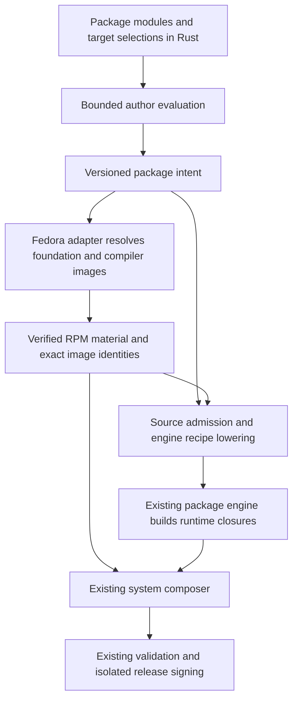

# Rust package DSL for Kedra

Status: **proposed; specification only; no implementation authorized or delivered**.
Date: 2026-10-05 (Europe/Kyiv). Independent documentation PR against main
`b224d5711e857f7dbcaabf7ed42870916525800c`; it does not join or rewrite the active
delivery stack. Implementation depends on the reviewed engine/catalog/release
contracts from drafts33–37 and must rebase its assumptions when those settle.

The owner requested a better package-authoring experience using a custom Rust DSL,
including Fedora packages. The proposal is a small **embedded DSL**: normal Rust
constructors/builders, modules and compiler diagnostics. There is no second parser,
interpreter, expression language, daemon or replacement RPM dependency solver.

An author will edit one package module, a nearby build script when needed, and
reviewed source pins. One package-set declaration selects Fedora requirements and
engine-built packages. The same intent lowers into two explicit paths:

The DSL describes Fedora RPM selection; it does not build Fedora packages from
source or relocate RPM files into the engine store. Fedora's installed paths and
the engine's separate store paths remain distinct. Live home reconciliation and
the separately planned niri/home-artifact improvement are outside this spec.

Read in order:

1. [Requirements and acceptance scenarios](requirements.md)
2. [Design, authoring examples and migration](design.md)
3. [Implementation tasks](tasks.md)
4. [Future executable/manual cases](test-cases.md) and [verification plan](test-plan.md)
5. [Specification review and evidence](review.md)

All future tasks and runtime cases start **not-run**. Examples show proposed API
shape, not existing callable methods. No package definition, list, Cargo manifest,
engine, workflow, installer or live machine is changed by this PR.

## Inspected source, not assumptions about main

The separate delivery checkout was inspected at
`95c5c6cf9856b9dc5d54bbb076f74aa185ae4c9f`; relevant package/source/release files
match published `e908bb281c3dc5189373c48a5ab4958c1b9d2fde` by ordinary Git diff.
The source links below pin that published snapshot because these components are
not yet on this PR's main base:

- [Built-in recipes](https://github.com/Reidond/kedra/blob/e908bb281c3dc5189373c48a5ab4958c1b9d2fde/usr/src/kedra/crates/sysroot-catalog/recipes.rs): jq1.8.2 and SQLite3.53.4, archive/tree pins and embedded shell text.
- [Catalog API](https://github.com/Reidond/kedra/blob/e908bb281c3dc5189373c48a5ab4958c1b9d2fde/usr/src/kedra/crates/sysroot-catalog/lib.rs): typed packages, independent allowlists and lowering to engine graphs.
- [Catalog CLI](https://github.com/Reidond/kedra/blob/e908bb281c3dc5189373c48a5ab4958c1b9d2fde/usr/src/kedra/crates/sysroot/catalog.rs): external JSON catalogs are accepted for list/plan/resolve/build, while contribution selects the built-in jq/SQLite pair and embeds templates.
- [Source resolver](https://github.com/Reidond/kedra/blob/e908bb281c3dc5189373c48a5ab4958c1b9d2fde/usr/src/kedra/crates/sysroot/source.rs): shared/target package lists, global removals and retained-layout support.
- [Foundation assembly](https://github.com/Reidond/kedra/blob/e908bb281c3dc5189373c48a5ab4958c1b9d2fde/usr/src/kedra/image/assemble.sh): DNF upgrade/install/remove plus actual RPM material.
- [Release material](https://github.com/Reidond/kedra/blob/e908bb281c3dc5189373c48a5ab4958c1b9d2fde/usr/src/kedra/image/release/material.py): exact recipe/tool inventory, compiler RPM material and a currently closed jq/SQLite inventory.

Main-thread runtime failures and incomplete native fault qualification remain in
their owning records. This document does not change those acceptance gates.
