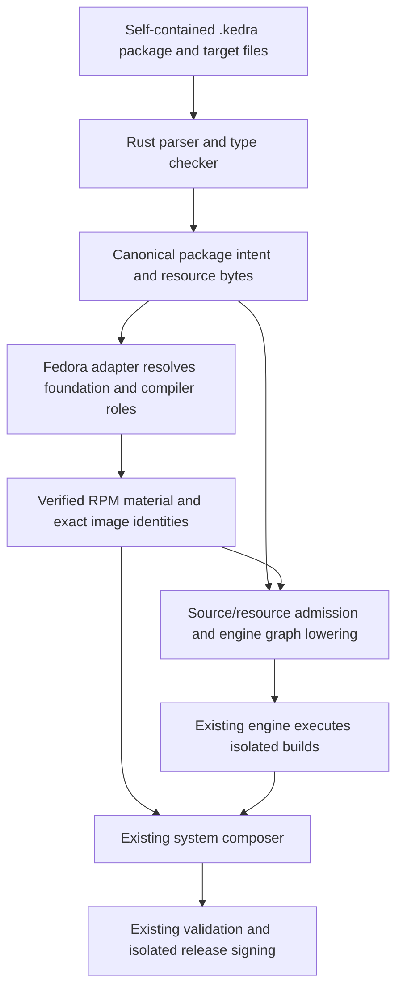

# Kedra package language

Status: **specification and v1 implementation delivered; verification scopes recorded**.
Updated: 2026-10-06 (Europe/Kyiv). [PR38](https://github.com/Reidond/kedra/pull/38)
is reconciled with delivered main `b60bcb081d1f88f616c1f597a3194c64d7c8b6c5`.
The owner explicitly requests finishing this specification and implementing the
language and migration. Prior D1–D5 and Noctalia runtime gaps remain independent.

The owner approved a **standalone `.kedra` language implemented in Rust** and
prefers most packages to carry their build logic directly in those files. This
supersedes the first revision's embedded Rust DSL/author-crate choice. The approval
changes the earlier no-new-language decision for this specific package
frontend; it does not authorize a new OS backend or generic scripting platform.

A normal package definition contains its metadata, pinned source reference,
build/runtime dependencies, shell commands, patches, small source/generated files
and exports. Separate `.sh`/patch/template files are supported exceptions for large
or independently maintained assets, rather than the default recipe structure.
Large upstream archives stay external and pinned. We are not proposing to paste
whole upstream projects or credentials into package files.

Parsing, imports, template expansion and planning execute no author-provided
commands. Embedded shell executes only later inside an approved builder. The Rust
API remains a secondary programmatic frontend to the same validated intent; a
package edit does not compile Rust or require rebuilding the engine/CLI.

Fedora declarations select RPMs for the foundation/compiler environment. They do
not rebuild Fedora packages from source or move RPM paths into the engine store.
Live home reconciliation and the separate niri/home-artifact improvement remain
outside this package-language spec.

Read in order:

1. [Requirements and acceptance scenarios](requirements.md)
2. [Language syntax, examples and precise content semantics](language.md)
3. [Architecture, lowering and migration](design.md)
4. [Implementation tasks](tasks.md)
5. [Executable/manual cases](test-cases.md) and [verification plan](test-plan.md)
6. [Review and evidence](review.md)

Task and case states are maintained in tasks.md and test-plan.md. The language
contract describes the delivered v1 syntax; qualification is recorded per workflow.

## Inspected source, not assumptions about main

The delivery checkout was inspected at
`95c5c6cf9856b9dc5d54bbb076f74aa185ae4c9f`; relevant package/source/release files
matched published `e908bb281c3dc5189373c48a5ab4958c1b9d2fde` by ordinary Git diff.
These links preserve the original design inspection; delivered main b60bcb0 now
contains that foundation, and PR38 adds the implementation described above:

- [Recipes](https://github.com/Reidond/kedra/blob/e908bb281c3dc5189373c48a5ab4958c1b9d2fde/usr/src/kedra/crates/sysroot-catalog/recipes.rs): jq 1.8.2, SQLite 3.53.4, archive/tree pins and shell text.
- [Catalog API](https://github.com/Reidond/kedra/blob/e908bb281c3dc5189373c48a5ab4958c1b9d2fde/usr/src/kedra/crates/sysroot-catalog/lib.rs): independent policies and engine graph lowering.
- [Catalog CLI](https://github.com/Reidond/kedra/blob/e908bb281c3dc5189373c48a5ab4958c1b9d2fde/usr/src/kedra/crates/sysroot/catalog.rs): external Catalog JSON support, fixed jq/SQLite contribution and embedded templates.
- [Source resolver](https://github.com/Reidond/kedra/blob/e908bb281c3dc5189373c48a5ab4958c1b9d2fde/usr/src/kedra/crates/sysroot/source.rs): package lists, removal lists and retained-layout compatibility.
- [Assembly](https://github.com/Reidond/kedra/blob/e908bb281c3dc5189373c48a5ab4958c1b9d2fde/usr/src/kedra/image/assemble.sh) and [release material](https://github.com/Reidond/kedra/blob/e908bb281c3dc5189373c48a5ab4958c1b9d2fde/usr/src/kedra/image/release/material.py): DNF operations, exact RPM/compiler material and the current closed inventory.
- [Engine model](https://github.com/Reidond/kedra/blob/e908bb281c3dc5189373c48a5ab4958c1b9d2fde/usr/src/kedra/crates/sysroot-engine/model.rs) and [plan validation](https://github.com/Reidond/kedra/blob/e908bb281c3dc5189373c48a5ab4958c1b9d2fde/usr/src/kedra/crates/sysroot-engine/plan.rs): 8 MiB graph data, 256 nodes and bounded arguments. Inline scripts must become file inputs, not oversized command arguments.

This spec does not change the delivery's runtime failures or acceptance gates.
