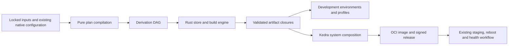

# A reusable Rust build and configuration engine for Kedra

Research synthesis, 2026-10-01. This is a proposed architecture, not an
implementation claim or an approved change to the operating-system contracts.

The motivation is the owner's requested capability: one reusable Rust engine for
granular builds, environments and declarative OS composition. Current Kedra
already builds, signs, installs and updates whole Fedora bootc images. No measured
failure frequency, performance gain or economic benefit from replacing that
system is claimed. The new engine is an intentional product direction, not a
repair of an established bootc defect.

## Goal and boundary

Build an independent Rust implementation of the useful Nix model: explicit build
inputs, immutable coexisting outputs, complete supported runtime closures,
cacheable realizations, profiles/generations, and declarative system composition.
Kedra is the first consumer. Another personal project should be able to use the
same library and artifact protocol while defining its own packages, host models,
release trust and activation policy. Kedranix is reference only and will be
rewritten later; no adapters or changes to that repository are delivered here.

"Independent" means that the engine does not invoke Nix to evaluate, build,
register paths or collect garbage. A temporary use of an existing evaluator
library would be an explicitly selected frontend dependency, not a hidden Nix
runtime requirement. Nix expression compatibility, nixpkgs compatibility, Nix
store/cache protocol compatibility and Nix-style user workflows are four
different commitments. The last is the goal; the first three remain optional.

## Recommended decomposition



The generic engine owns artifact identities, realization, references, transfer,
roots and profile selection. Kedra owns the Fedora adapter, target table, package
catalog, generated service/configuration files, image composition, public trust,
installed privileged helper, home review and boot health. The engine must not
embed `Reidond/kedra`, current target names, Fedora versions or production keys.
Reusable configuration merge/provenance primitives can live in the engine;
Kedra's option definitions, defaults and effectful activation remain outside it.

Start with one reusable flat-source crate, provisionally `sysroot-engine`, under
`usr/src/kedra/crates/`, with a thin `sysroot` command surface. Keep the existing
`sysroot-core` contracts separate: they currently contain Kedra-specific release,
target and home rules and are not a generic package-manager library. Split the
new crate only when implemented boundaries warrant it. Its public API and artifact
schema can be pinned by Git revision initially; extraction into a separately
versioned personal repository should follow a working second-consumer experiment.
No separate repository, package publication or Cargo change is made in this task.

## Identity, output bytes and dependency closure

Propose a versioned `BuildSpec` with validated types for source objects, builder,
argv, allowlisted environment, build/host/target platforms, input outputs, declared
runtime inputs, named output slots, store prefix and sandbox policy. The build
platform runs tools; the host platform runs the result; a compiler's target
platform is a further distinction. Start on native aarch64 Linux in a disposable
Mac-controlled Linux environment; qualify x86_64 independently before OS integration.
Support one output per derivation initially. Named output slots remain in the
model, but a declaration with multiple slots is refused until derivation-level
coordination and atomic output-set registration/recovery are qualified. Cross
compilation and native Darwin builders need separate gates.

Three identities must remain separate:

| Identity | What it names | Purpose |
|---|---|---|
| `DerivationId` | Canonical versioned build specification and dependency identities | Predict outputs and decide whether realization is needed |
| `OutputId` / store path | A named output of a derivation in one canonical store namespace | Coexistence and stable references before building |
| `TreeDigest` | Canonically encoded output bytes and supported file metadata | Verify transfer and detect divergent results |

Start with input-addressed outputs and separately hash their realized trees.
Do not describe a hash of build inputs as proof that the output is reproducible.
An independent rebuild can disagree for the same `DerivationId`; preserve the
existing object, quarantine the alternative and report divergence. Do not
overwrite a valid realization or quietly choose a winner. True content-addressed
derived outputs, self-reference rewriting and floating output paths are later
features, not required to start with Nix's original useful model.

The canonical representation must define field ordering, ordered versus unordered
collections, text encoding, integer representation, path normalization, hash
algorithm, format version and output naming. Do not hash incidental TOML spelling,
ordinary unordered JSON output, host absolute checkout paths or filesystem mtimes.
The canonical store prefix affects embedded output references and therefore
belongs in the identity domain. Different prefixes do not share binary results
merely because their source inputs are equal.

Portable tree hashing and full OS metadata also need separate contracts. A NAR-like
tree format can describe bytes, directories, symlink targets and executable flags,
but those fields alone do not authenticate ownership, arbitrary modes, SELinux
labels or file capabilities. Define the supported store-object metadata explicitly.
The Kedra image composer must independently preserve/apply authenticated OS
metadata and verify it in the installed system; do not advertise a package-tree
digest as an OS security-metadata attestation.

Each committed object has a receipt binding its output identity, tree digest,
file size, reference set and producing derivation. Runtime closure is transitive
reachability through output references, distinct from all inputs needed to build.
For the first supported recipes, combine explicit runtime references with
conservative scanning against the entire declared input closure, including
regular-file bytes, names and symlink targets in the serialized object. Do not
rely only on ELF dependency listings or declared labels.
Dynamic path construction and dependencies outside the store must be rejected
or represented as explicit runtime capabilities; scanning is not a proof of
completeness for arbitrary software. Generated system configuration depends on
its referenced programs just as binaries do.

## Realization, sandboxing and bootstrap

Evaluation compiles a plan without fetching, building, reading undeclared host
files or accessing credentials. A separate lock/update operation resolves mutable
names to verified content and records them. Normal planning and building refuse
missing pins. Fetching verifies expected bytes before a builder can see them.
Git remains the normal Git implementation, not a new Git engine.

Source-update authorization is a separate operation from content reuse. A digest
proves which bytes were selected, not who authorized changing that selection or
whether it is fresh. Verification policy/evidence and accepted-key versions must
remain inputs to an authorization receipt, and the authorization check must not
be skipped because source bytes already exist in a fixed-output cache. Preserve
accepted update history independently of an explicit owner rollback. This is a
proposed stronger boundary, informed by [S-001 §§4–6, PDF19–32](sources/papers/ba.pdf),
not a claim that the 2024 thesis's fetchers remain vulnerable today.

The scheduler realizes the complete static DAG with bounded workers, cancellation,
derivation-level coordination and clear failure propagation. Builders are ordinary
disposable Linux processes with declared inputs mounted read-only, private output
and temporary directories, restricted environment, and no network by default.
Source fetchers run in a separate phase. Host home, SSH agent, vault, sockets,
undeclared `/usr`, environment variables and credentials are not build inputs.
Sandbox enforcement and kernel/CPU assumptions must be qualified rather than
inferred from a recipe hash. An unrestricted fallback must not populate the same
cache identity as a sandboxed build.

The bootstrap cannot be "install gcc from the current network repository." Start
with a reviewed immutable Linux builder image or a retained toolchain closure,
bound by digest and platform to the recipe. Treat a Fedora root as an explicitly
declared coarse bootstrap/runtime artifact; it is not a set of already isolated
Nix-style packages. Later replace selected bootstrap tools with store-built tools.
Full compiler bootstrap, libc/linker isolation and the package catalog are major
workstreams. Rust implementation of the manager does not eliminate C libraries,
ELF loaders, shebangs, RPATHs, GPU drivers or prebuilt proprietary software.

For each output, runtime requirements are either store-contained dependencies or
an explicit digest-bound runtime root artifact. The latter travels with the
closure and its execution metadata. An "empty receiver" has no undeclared
userspace: it receives the whole required root/loader/libc as well as package
objects, runs offline, and refuses a missing/wrong runtime root. A compiler's
bootstrap image does not silently satisfy runtime dependencies on another host.

For Fedora-sourced artifacts, preserve actual RPM payloads, full transitive
resolution and repository evidence. Package version strings or a moving repo's
current metadata are insufficient for offline rebuilds. The present assembler
still resolves RPMs through live DNF; the release gate checks matching package
material, which is valuable evidence but not an archived hermetic build recipe.
See [image assembly](../../usr/src/kedra/image/assemble.sh) and
[release material](../../usr/src/kedra/image/release/README.md).

## Store durability, profiles and collection

Build with private staging backing files mounted at the final logical output
pathname inside the sandbox. This preserves embedded output paths; building at an
unrelated temporary pathname then renaming would not. Before hashing/sealing,
stop all builder descendants and close possible writable handles; permission
changes alone do not revoke an already-open writable descriptor. Validate paths,
supported file types,
references and hashes before committing immutable objects. Publication uses a
durable journal and atomic rename on the relevant filesystem; index registration
must recover from interruption between filesystem and database operations. Do not
follow imported symlinks or hardlinks during extraction. Engine readers consume
only indexed, validated objects. When multiple outputs are enabled, one derivation
lease and one validated output-set commit must prevent duplicate realizations and
references to half-registered siblings. Unknown schemas, corruption, full disk and stale
operations must have explicit refusal/recovery behavior.

Use an ordinary embedded index if needed; existing workspace SQLite and hashing
dependencies are candidates, not a dependency mandate. The first useful writer
model can be one management process with parallel unprivileged workers, rather
than a permanent daemon. Root-owned shared-store writes, if later needed, must
use a separately qualified narrow helper; user-private development cannot grant
root authority. Arbitrary builders never run inside the root helper.

Profiles retain named generations that point to immutable environment closures.
Switch a profile by replacing a single authoritative pointer after its new
closure is present and verified. Readers acquire a protected generation/lease
before use. A profile switch is atomic for the reference, not for all running
processes or mutable application state. Active processes can keep old libraries
and versions until restarted.

Garbage collection walks runtime references from profiles, retained rollback
generations, published/installed image roots and in-flight build/import/run roots.
Coordinate root publication, collection and use so a running command or builder
cannot lose its dependencies. Expiring a lease requires an observed process/use
policy, not an arbitrary timeout. Initial deletion should be explicit; no
automatic GHCR cleanup or hidden deletion of recovery images is added.
Within the engine-owned store, invalidate/delete referrers before dependencies,
and journal interrupted deletion. Refuse unsupported non-self reference cycles
initially. Image-owned objects are retained by the deployment backend; generic
GC must not race bootc or remove another backend's deployment contents.

## Declarative configuration and the frontend

The configuration layer describes packages, services, vendor configuration,
accounts, mounts, boot requirements and capabilities, then compiles static files
and an activation plan. Its reusable internal contribution API needs typed values,
explicit dependencies, defaults/overrides, per-value merge behavior, conflict
diagnostics and source provenance. Equal-priority scalar conflicts should fail
with both sources; ordered lists, package sets and keyed service maps need
different merge rules. This smaller explicit model does not reproduce NixOS's
lazy final-configuration fixed point. See [S-004 §5.1/§6.3, PDF17–20/31–32](sources/papers/nixos-jfp-final.pdf)
and [the modern module contract](https://nixos.org/manual/nixos/stable/#sec-writing-modules).

Recommend lowering the existing Kedra source plan, target TOML, package lists and
native Linux configuration through a reviewed Rust authoring API into a versioned
`SystemPlan`. Shared typed composition primitives can be reused by another Rust
consumer. Keep lockfiles and serialized plans as data records. Do not introduce
a new user-authored TOML language with imports, expressions, references or
conditions merely by calling it a schema: that would conflict with the settled
no-custom-configuration-language contract. Broader authoring UX remains a visible
decision, not part of the first engine milestone.

Rust authoring code can still perform arbitrary ambient IO. A pure planning
promise requires an isolated evaluation process with only declared source inputs,
bounded resources and a restricted capability interface; Rust types alone cannot
enforce it. Typed `ArtifactRef`/output references must survive lowering into
command strings so dependencies are not lost. Keep evaluator-triggered builds
disabled initially. Nix's [string context](https://nix.dev/manual/nix/2.34/language/string-context)
and [import-from-derivation](https://nix.dev/manual/nix/2.34/language/import-from-derivation)
illustrate why evaluation/realization separation is a chosen contract.

Keep the build IR independent of the frontend. An existing Nix-expression
evaluator/library or another established language can be considered later without
redesigning the store. Full `.nix` compatibility entails lazy evaluation, string
dependency context, module semantics, builtins, errors and a compatibility corpus;
syntax alone does not make nixpkgs usable. The 2025 verified-interpreter paper
deliberately excludes paths, IO and derivations, so its proof is not a complete
package-manager implementation ([S-023 §5, PDF21–22](sources/papers/verified-nix-interpreters-2025.pdf)).
Selecting full compatibility or a new custom language is a separate product decision.

User workflows can resemble Nix while using Kedra's existing command identity.
These examples are **proposed interfaces and do not work today**:

```sh
sysroot build .#desktop
sysroot develop .#development
sysroot run .#tool -- ARGUMENTS
sysroot store closure OUTPUT
sysroot profile list
sysroot profile rollback
```

The selectors identify project outputs; they do not imply `.nix` parsing.
Planning returns a stable graph without realizing it. Human diagnostics go to
stderr and structured results to stdout. System staging/rollback remain distinct
from ordinary project profile operations and retain current helper authorization.

## Kedra integration and OS scope

The first OS consumer compiles a Kedra target into a locked static system closure
and exports it into the existing OCI release pipeline. Continue Fedora bootc,
per-target image signing, Secure Boot, enforcing SELinux, on-demand installer media,
explicit staging/reboot and qualified recovery during this step. That proves
useful declarative OS composition without simultaneously replacing every boot
component. It does not yet make Fedora's package set a fully source-built store.

The store prefix needs an early concrete experiment. `/sysroot` already names
bootc's physical root and must not be repurposed as a package store. A provisional
image-owned prefix under `/usr/lib/sysroot/store` fits the existing payload
layout. Builders can see that canonical prefix in disposable Linux namespaces;
physical host backing files are separate. On an installed bootc system `/usr` is
read-only, so the proposal must not promise in-place package registration there.
Initial `develop`/`run` realization can use a disposable Linux namespace or retained
lab. A future writable host store needs its own chosen prefix, key domain,
ownership and execution model. Either build for that prefix or qualify a
relocation design; blindly moving outputs breaks embedded references.

Static service files and defaults are build outputs. Service stop/start, account
reconciliation, runtime directories, secret injection and data migration are
effectful activation steps with explicit ordering and recovery. An immutable
closure fixes the selected static artifacts; reproducible rebuilding requires
separate evidence. It does not make a database migration
reversible. System generations and release/boot health are separate state
machines. Do not claim cluster-wide atomicity from local profile swaps.

Kedra's writable home review remains authoritative. Preserve selected publication,
unstaged edits, local-only exclusions and application coordination. The new store
may own baselines and tools; it must not replace real home files with read-only
symlinks or capture personal agent/vault data. `/var`, credentials and application
databases remain outside OS rollback.

A full store-composed OS backend can follow only after the package/runtime and
activation model is qualified. It would need explicit decisions about root layout,
kernel/initramfs/boot loader, SELinux labels, encrypted installation, signature
authority, retained boot generations and recovery. It is a replacement of current
Fedora bootc contracts, not an unnoticed side effect of adding a Rust library.

## Cache trust and distribution

A local cache is an optimization, not an authority. Remote substitution must
verify the expected output identity, canonical content digest, exact references,
platform and store namespace before registering a closure. A trusted producer's
signature binds that receipt; neither a matching filename nor a content hash
alone proves that bytes came from the requested recipe. Signature policy and
keys are supplied by the consuming project.

Build cache authorities and Kedra OS release authorities must remain separate.
Existing isolated production signing executes no checkout or candidate binary
with keys. A cache import must not bypass the OS release gate. Generic closure
copy over a simple transport should precede distributed scheduling, Hydra-like
services or fleet orchestration. No permanent AI service is involved.

## Decisions still to make

1. Confirm frontend expectations: Nix-style workflows and a Rust/native-config API first,
   or mandatory existing `.nix`/nixpkgs compatibility.
2. Qualify the canonical store prefix and sandbox/backend model with actual
   Linux binaries, native dynamic libraries and image export.
3. Choose the retained bootstrap image/toolchain and first real package set;
   define exactly what reproducibility claim that foundation supports.
4. Decide whether the long-term Kedra deployment backend remains bootc or becomes
   a store-composed OS. The reusable core supports either; qualification differs.
5. Evaluate existing Rust Nix components on actual capabilities, maintenance,
   API/license compatibility and adoption cost before committing to reuse. The
   inspected Tvix mirror at `9bed4ce6fc4c308f28df485b286a9aee467af686` is an
   evaluator/simulated-store lead, not a ready independent builder/store engine;
   README goals must be checked against actual available components.

The immediate implementation candidate is one end-to-end vertical slice: a locked
real package with a runtime dependency, an isolated build, immutable registration,
closure transfer, execution and profile rollback. The system compiler follows on
that proven core. Detailed evidence and acceptance gates are in `roadmap.md`.

## Evidence behind the recommendations

These sources establish design principles and documented boundaries. The specific
Rust API, first prefix, sandbox, single-output scope and bootc integration sequence
above are proposed choices; none is an observed replacement-engine capability.

| Topic | Primary evidence and exact reading |
|---|---|
| Independent IR, immutable install space and selected environments | [S-016](sources/papers/nspfssd-lisa2004-final.pdf), PDF6–9 / printed84–87 |
| Input identity versus realized bytes; canonicalization and namespace | [S-012](sources/papers/phd-thesis.pdf), §§5.2–5.4, PDF98–114 / printed90–106; [current input-addressing algorithm](https://nix.dev/manual/nix/2.34/store/derivation/outputs/input-address) |
| Runtime references and conservative scanning limits | [S-012](sources/papers/phd-thesis.pdf), PDF65–67/121–122/187–188; [S-017](sources/papers/immdsd-icse2004-final.pdf), §§3–5, PDF3–5 |
| Durable registration, roots, concurrency and GC deletion order | [S-012](sources/papers/phd-thesis.pdf), §§5.5–5.6, PDF119–142; filesystem-durability caveat PDF121; [O1 focused findings](findings/O1-store.md) |
| Bootstrap and native runtime packaging | [S-012](sources/papers/phd-thesis.pdf), §7.1, PDF177–188; [S-002](sources/papers/Multi-PlatformSoftwarePackageManagement.pdf), §6.1, PDF43–46 |
| Content identity, trusted recipe correspondence and residual writers | [S-013](sources/papers/secsharing-ase2005-final.pdf), §§2.3–6.1, PDF4–9; [current verification contract](https://nix.dev/manual/nix/2.34/command-ref/new-cli/nix3-store-verify) |
| Tree metadata is not full OS metadata | [NAR grammar](https://nix.dev/manual/nix/2.34/protocols/nix-archive/) and [filesystem model](https://nix.dev/manual/nix/2.34/store/file-system-object); Kedra requirements in its current architecture |
| Source bytes versus authorization/freshness, cached verification | [S-001](sources/papers/ba.pdf), §§4–6, PDF19–32; dated2024, with [O3's modern bridge](findings/O3-security.md) |
| Static system graph, module merging, mutable state and activation | [S-004](sources/papers/nixos-jfp-final.pdf), §§5–6, PDF17–35; [current system-switch sequence](https://nixos.org/manual/nixos/stable/#sec-switching-systems) |
| Distributed transition assumptions | [S-006](sources/papers/atomic-hotswup2008-final.pdf), §§5–7, PDF4–5; not unconditional service/data atomicity |
| Evaluator scope and compatibility | [S-009](sources/papers/laziness-ldta2008-final.pdf), §2, PDF3–6; [S-023](sources/papers/verified-nix-interpreters-2025.pdf), §5, PDF21–22 |
| CI and E2E environments | [S-003](sources/papers/decvms-issre2010-final.pdf), §§III–IV, PDF4–7; [S-008](sources/papers/buildfarm-wasdett2008-final.pdf), §2, PDF3–7; [S-011](sources/papers/628612.pdf), §4, PDF80–84 / printed69–73 |
| Actual Rust reuse boundary | [Pinned Tvix glue](https://raw.githubusercontent.com/tvlfyi/tvix/9bed4ce6fc4c308f28df485b286a9aee467af686/glue/src/tvix_store_io.rs), [simulated store](https://raw.githubusercontent.com/tvlfyi/tvix/9bed4ce6fc4c308f28df485b286a9aee467af686/simstore/src/lib.rs), [O1 inspection](findings/O1-store.md); code presence is not runtime fitness |

All 23 selected source packets, their fuller findings and reusable citations are
indexed by [the reading guide](reading-guide.md). No historical performance figure
is used as a forecast. No current exploit, interoperability, complete runtime
closure, build reproducibility or new OS qualification is claimed by this research.
